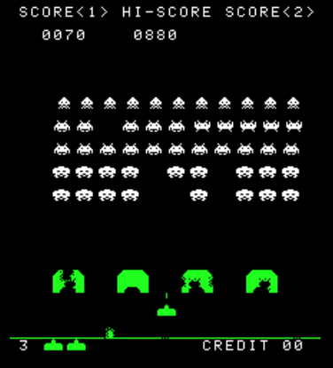

# Development

```
cd space-invaders
npm install
npm run dev
```

# Build

```
cd space-invaders
npm run build
cd ./dist
```

# Задание
Реализовать клон культовой игры Space Invaders с прогрессией и аналитикой.

- [x] Collision Detection для попаданий снарядов в пришельцев
- [ ] Логика атаки врагов - в какой момент стреляет враг? Куда целится? Как влияет на соседей?
- [x] Очистка массивов объектов - если враг убит или снаряд покинул экран, его не нужно далее отслеживать
- [ ] Доп. режимы - если игрок выполняет несколько убийств подряд или очищает линию, то враги становятся сильнее на n секунд 
	(стреляют чаще, снаряды меняют цвет и летят быстрее)
- [x] Обработка поведения при выходе пушки за canvas
- [ ] Опционально - добавить логику разрушения бункеров.
- [ ] Предложить алгоритм для движения пришельцев
- [ ] Предложить альтернативные формации пришельцев
- [ ] Опционально - Friendly Fire для пришельцев.
- [ ] Учесть ситуацию, когда снаряд за кадр пролетит через пришельца
- [ ] Обработать ситуации победы и поражения (сколько есть запасных пушек)
Возможный вариант реализации:



